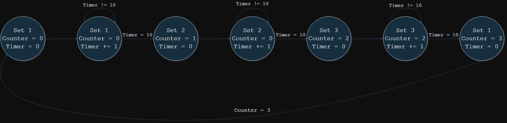

*BomberMan-Game-ASM-CIIC4082*
==========

# FSM Diagram for sprite animations of Task #2



# Palettes Used:
## Tank:
### Main:
#### Blue:
```asm
0f 11 21 01
```
### Alternate Pallettes for Tank:
#### Green:
```asm
0f 1A 2A 0A
```
#### Red:
```asm
0f 17 27 07
```
#### Yellow:
```asm
0f 18 28 08
```

# Background Palettes Used:
## Stone:
```asm
0f 00 10 30
```

## Brick:
```asm
0f 05 16 37
```

## Bushes:
```asm
0f 0B 1A 29
```

## Wood:
```asm
0f 26 36 37
```

# Background Nametables Excel Doc
https://sistemaupr-my.sharepoint.com/:x:/r/personal/nelson_escalona_upr_edu/Documents/BackgroundDesign.xlsx?d=w1b2c20ab7e1c462c8e533a43e49965b7&csf=1&web=1&e=FjJpfe
